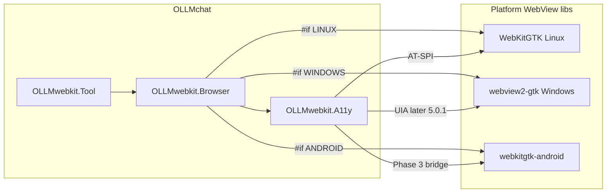

# 1.0 — webkitgtk-android (Android WebView as WebKitGTK-shaped GTK widget)

**Status:** **⏳** Phase 3 — dump verified **without** any AccessibilityService (app-process DirectConnection); awaiting user **✅**

**Where we are:**

- **✔️** Phase 0 — docs / this plan
- **✔️** Phase 1 — GTK Hello World on Android (**no** WebView) — user **✅**
- **✅** Phase 2 — basic WebView embed + display — user **✅** (GTK chrome + HTTPS roojs.com)
- **⏳** Phase 3 — accessibility dump / fill / press (**mirror webview2-gtk host a11y**) — agent-verified dump (~394 nodes, no wake service); awaiting user **✅**

**Pointer:** [`docs/guide-to-writing-plans.md`](../guide-to-writing-plans.md) — **Checklist for plans**

**Related:**

- ℹ️ Windows sibling: `/home/alan/git/webview2-gtk` (GTK 4 + Edge WebView2, WebKitGTK-shaped API)
- ℹ️ Consumer: `/home/alan/gitlive/OLLMchat` — `libocwebkit` browser tool; Android track [`5.0.2-android-webkit-control.md`](file:///home/alan/gitlive/OLLMchat/docs/plans/5.0.2-android-webkit-control.md)
- ℹ️ Parent tool contract: OLLMchat [`5.0-ACTIVE-webkit-control.md`](file:///home/alan/gitlive/OLLMchat/docs/plans/5.0-ACTIVE-webkit-control.md) (a11y markdown, fill/press — **not** DOM/JS scrape)
- ℹ️ Android packaging precedent: OLLMchat Pixiewood under `.pixiewood/` / `docs/android-build.md`

---

## Purpose

- **🔷** New standalone library (this repo) that wraps **Android System WebView** (`android.webkit.WebView`) so Vala/GTK apps can embed a browser the same way **webview2-gtk** embeds Edge on Windows.
- **🔷** Emulate the **basic WebKitGTK 6 `WebKit.WebView` API** (navigation, URI/title, load signals, cookies/session) so OLLMchat can write:

```vala
#if ANDROID
using WebKitGtkAndroid;
#elif WINDOWS
using WebView2Gtk;
#else
using WebKit;
#endif

var web = new WebView ();
web.load_uri ("https://roojs.com/");
```

- **🔷** **Primary product focus:** **accessibility** — dump tree → markdown-ready node data, **fill**, **press** — so `libocwebkit` / OLLMchat **5.0.2** can share the Linux a11y contract on Android.
- **🔷** **Secondary focus:** embed the native WebView inside a GTK 4 widget (Pixiewood / JNI), sized to the widget allocation.
- **🔷** **Delivery order (testable):** Phase **1** GTK Hello World → Phase **2** WebView display → Phase **3** a11y (see **Phases**).
- **🔷** Phase 2 demo URL: **https://roojs.com/** (optional URL arg, same shape as webview2-gtk `examples/browser`).
- **🔷** Ship **VAPI + pkg-config** so OLLMchat Android links this like `webview2gtk-1` on Windows.
- **🔷** Design for **background agent browsing**: keep a **phone-sized virtual viewport** when the WebView is hidden (avoid Android’s 0×0 layout trap).
- **🔷** Design for **a11y without TalkBack**: Chromium WebView a11y is lazy until forced — spike a hard enable path (see research).
- **🚫** Screenshot / capture / PDF / `get_snapshot` — **out of scope** for this library (OLLMchat browser tool does not need them).
- **🚫** Do **not** implement dump/fill/press via injected page JavaScript or DOM walks — a11y tree only (same rule as OLLMchat **5.0**).
- **🚫** This repo is **not** `libocwebkit` and **not** the OLLMchat browser tool — it is the **platform backend** (Android analogue of webview2-gtk). Tool/markdown/CF/globe stay in OLLMchat **5.0.2**.

---

## Why this repo exists

- **🔷** OLLMchat Linux uses **WebKitGTK** + AT-SPI (`OLLMwebkit.A11y`).
- **🔷** OLLMchat Windows will use **webview2-gtk** (+ UIA a11y in **5.0.1**).
- **🔷** OLLMchat Android needs the same **`WebView` call sites** + an a11y backend — Android has **no** WebKitGTK and **no** AT-SPI.
- **🔷** webview2-gtk already proved the pattern: separate sibling library, WebKit-shaped Vala API, native host under the hood, VAPI for consumers.
- **ℹ️** OLLMchat **5.0.2** currently assumes “Pixiewood / JNI as needed” inside chat — better to land the hard embedding + a11y bridge **here**, then wire `#if ANDROID` in `libocwebkit` like the Windows `#if WINDOWS` + webview2-gtk path.

---

## Non-goals (guardrails)

- **🚫** Full WebKitGTK surface (inspector, extensions, custom URI schemes, print, snapshot, …).
- **🚫** Screenshot / crawl-pool / site-login / SERP JavaScript scrape stacks.
- **🚫** Replacing OLLMchat’s `OLLMwebkit.A11y` markdown walker — this lib exposes **raw** dump/fill/press primitives (or a thin structured dump); `A11yParse` / press-refs stay in `libocwebkit`.
- **🚫** Linux or Windows builds of this library (Android-only, mirror of webview2-gtk being Windows-only).
- **💩** Multiple WebViews per process — start with **one host** if the platform forces it (webview2-gtk v0.1 limitation); revisit when OLLMchat needs more.

---

## Precedent — webview2-gtk layout to mirror

ℹ️ Source: `/home/alan/git/webview2-gtk`

```
lib/host/           native host (COM / Win32 there; JNI / Java here)
lib/webview2gtk/    public GTK widget (Vala) — WebKit-shaped names
vapi/               published .vapi
examples/hello/     minimal page
examples/browser/   back / forward / reload / URL bar
scripts/            vendor / build / package
*.pc.in             pkg-config
```

**🔷** This repo should feel the same to a consumer:

- **Widget:** `WebView2Gtk.WebView` → `WebKitGtkAndroid.WebView` (name lock below)
- **Native parent:** Win32 HWND → Android `View` overlay / attach to GTK Android surface
- **Engine:** WebView2 COM → `android.webkit.WebView` + `WebViewClient` / `CookieManager`
- **A11y:** webview2-gtk defers to **5.0.1** → **this lib ships a11y in v1**
- **Capture:** `get_snapshot` etc. → **omit**

---

## Naming (proposed — confirm)

- **🔷** Repo / Meson project: **`webkitgtk-android`**
- **💩** Vala namespace: **`WebKitGtkAndroid`** (parallel to `WebView2Gtk`)
- **💩** pkg-config / lib: **`webkitgtk-android-1`** / `libwebkitgtk-android-1`
- **💩** VAPI: `webkitgtk-android-1.vapi` (checked-in + Meson-generated build-tree; see **[`1.2`](1.2-consumer-packaging.md)**)
- **🔷** Public widget class: **`WebView`** (same as WebKit / WebView2Gtk)
- **💩** Load enum: **`LoadEvent`** with `STARTED` / `REDIRECTED` / `COMMITTED` / `FINISHED` (WebKitGTK names)

Promote **💩** names to **🔷** on review if accepted.

---

## Public API — WebKitGTK-shaped subset (embed)

Match what **OLLMchat `libocwebkit.Browser`** actually calls on `WebView` today — not the entire WebKitGTK docs.

### Must have (v1)

- **🔷** `load_uri` / `load_html` / `load_plain_text`
- **🔷** `go_back` / `go_forward` / `reload` / `stop_loading`
- **🔷** `can_go_back` / `can_go_forward`
- **🔷** `get_uri` / `get_title`
- **🔷** `is_loading` / `estimated_load_progress` (progress may be approximate)
- **🔷** `zoom_level` getters/setters (best-effort on Android)
- **🔷** signal `load_changed (LoadEvent)`
- **🔷** signal `load_failed (...)` (WebKit-shaped bool return if practical)
- **🔷** `get_network_session()` → cookie manager (`get_cookies` / `add_cookie` async, accept policy) — enough for OLLMchat-style `site_cookies`
- **🔷** Android-only: `ready` (native WebView attached), like WebView2Gtk

### Nice / when needed by CF

- **✔️** `main_document_response (status, headers)` — OLLMchat Cloudflare; Android: main-frame `onReceivedHttpError` (≥400 + headers) + synthetic `200` on `onPageFinished` when no HTTP error (System WebView has no public 2xx header callback). Mirrors webview2-gtk signal (Linux uses `decide_policy` RESPONSE).
- **💩** `evaluate_javascript` — **not** for a11y dump/fill/press; only if settle/`readyState` or `html` format later needs it (OLLMchat deferred html dump)

### Explicitly omit

- **🚫** `get_snapshot` / print / capture APIs
- **🚫** Full settings/inspector/policy surface unless a consumer call site demands it

---

## Research notes (2026-07-21) — a11y init + background size

User warnings + web/Chromium evidence. Treat as design constraints for Phase 1 / Phase 4 spikes.

### Engine under the hood

- **ℹ️** Android “WebKit” in apps is almost always **Android System WebView** / Chrome WebView — Chromium, not Apple WebKit / not WebKitGTK.
- **ℹ️** Web content a11y is implemented by Chromium’s **`WebContentsAccessibilityImpl`** (Java `AccessibilityNodeProvider` over a virtual tree). Nodes are built **on demand**, not as a persistent mirror of the DOM.
- **ℹ️** Upstream doc: [Chrome Accessibility on Android](https://chromium.googlesource.com/chromium/src/+/HEAD/docs/accessibility/browser/android.md) — same machinery applies to **WebView** and Custom Tabs (with WebView-specific edge cases).

### Lazy a11y init (“won’t turn on unless hard-coded on”)

- **🔷** Chromium **deliberately** keeps WebView a11y **lazy / on-demand** because a11y is a **steep performance (and battery) cost**.
- **🔷** Native a11y only fully wakes when the framework calls **`getAccessibilityNodeProvider`** on the WebView — and that path is tied to **`AccessibilityManager.isEnabled()`** (an accessibility service such as TalkBack / UiAutomator bridge is active).
- **🔷** Until that happens, dumps often see **only the outer WebView node** (or an empty virtual tree) — matching “notoriously doesn’t initialize” reports and UiAutomator “lost WebView children” bugs across WebView versions.
- **ℹ️** Separate OEM issue: battery / power-saver can **disable AccessibilityServices** after a while (Tasker etc.). That is about **keeping a service alive**, not about Chromium’s lazy init — but both bite agent browsing if we depend on a real service.
- **ℹ️** Chromium exposes **`setAccessibilityEnabledForTesting()`** / `mAccessibilityEnabledForTesting` **inside** `WebContentsAccessibilityImpl` — **not** a public app API. We cannot call it from Vala/JNI against stock System WebView.
- **ℹ️** Deprecated old path: `AccessibilityInjector` + Secure setting `ACCESSIBILITY_SCRIPT_INJECTION` — do **not** plan on this.
- **🔷** **Implication for OLLMchat:** dump/fill/press must work **without** the user enabling TalkBack. Phase 4 must spike a **force-on strategy** (below), not assume a11y is always live.

### Force-on strategies to spike (ordered)

1. **⏳** **🔷** Same-process: `WebView.createAccessibilityNodeInfo()` + **`AccessibilityNodeInfo.setQueryFromAppProcessEnabled(view, true)`** (API **34+**) — walk/act without an `AccessibilityService`. Still may need the provider to have been **initialized** once.
2. **⏳** **🔷** Trigger provider init without TalkBack — e.g. send / request accessibility events, or a **minimal in-app AccessibilityService** that only exists to wake the WebView tree (permission UX cost — last resort).
3. **⏳** **💩** Instrumentation / `UiAutomation` only for CI spikes — not for production chat.
4. **🚫** Rely on TalkBack being on for end users.
5. **🚫** Inject page JS to scrape the DOM as a substitute for a11y (OLLMchat **5.0** forbid).

### Visibility / “invisible” nodes

- **ℹ️** UiAutomator dumpers that skip `isVisibleToUser == false` often **drop real WebView children** (version-dependent). Our walker must **not** blindly trust that flag the way stock dumpers do — same lesson as Linux AT-SPI noise filtering, but inverse risk.

### Background browse → 0×0 “screen”

- **🔷** Agent browsing often runs with the WebView **not shown** (chat UI up, globe off). On Android that easily becomes **width/height 0**.
- **🔷** Unattached or never-laid-out WebView: `getWidth()` / `getHeight()` stay **0**; HTML layout / painting / a11y **bounds** are wrong or empty. Community consensus: WebView **does not lay out** properly until attached **or** you force **`layout(0, 0, w, h)`**.
- **🔷** Official guidance: use **`match_parent`**-style exact sizes; **`wrap_content` is discouraged** and yields incorrect sizing.
- **🔷** Detached “headless” WebView + only `setLayoutParams` is **not** enough — must **`measure` + `layout`** with **EXACT** pixel size (phone display size).
- **🔷** Prefer: keep WebView **attached** to the hierarchy at **phone-sized** pixels, park with **`INVISIBLE`** or off-screen translation, rather than destroy/detach when globe is off.
- **🔷** **Virtual viewport policy (user):** when running in the background / not promoted, **pretend the viewport is the phone’s display size** (`DisplayMetrics` width×height, density-aware). Do **not** inherit a 0×0 GTK allocation for the native WebView host.
- **💩** When globe is on, sync bounds to the GTK widget allocation; when globe is off / tool-only, keep the last phone-sized (or forced) layout so settle + a11y stay valid.
- **ℹ️** Flutter / other “headless WebView” wrappers expose an explicit **`setSize`** for the same reason — we should too.

### CF / overlays vs a11y

- **ℹ️** Chromium returns **null** from `getAccessibilityNodeProvider` when content is marked **obscured by another view**. While frozen (native WebView hidden), a11y dump of the page may be empty or stale — acceptable for modal duration; resume restores provider.

### Modal freeze (Android) — design lock (after Phase 3)

**Problem:** System WebView is an Android `View` **above** the GTK `SurfaceView`. GTK dialogs paint into the SurfaceView → they appear **under** the live page. You cannot composite GTK pixels over a visible WebView `View`.

**Trigger (GTK side — automatic):**

1. Vala `WebView` watches its **same toplevel** for overlay UI (GObject type name `AdwDialog` by string / transient `Gtk.Window`; hook **`parent-set`** before map).
2. When that happens → **enter freeze**.
3. When it unmaps / closes → **exit freeze** (resume).
4. **🚫** No manual freeze API for apps — monitor only (see bug strategy if lag persists).

**On enter freeze:**

1. Take a **snapshot** of the current native WebView.
2. Show that image in the **GTK layer** (e.g. `Gtk.Picture` over the widget allocation).
3. Make the native WebView **invisible** (still attached, phone-sized layout kept — not destroy / not 0×0).

**While frozen — refresh:**

- **Default spike:** re-snapshot about **every 1s** and update the GTK picture (page can still change under the dialog: spinners, CF, navigations).
- **Refresh while frozen:** every **1s**, if dirty → recapture + update GTK picture + clear dirty; else skip.
- **Dirty:** `onDraw` while frozen (WebView stays visible under raised SurfaceView).
- **Implemented:** GTK toplevel overlay monitor (`AdwDialog` type-name string + transient windows, `parent-set` before map) → auto `refresh_freeze`; 1s dirty tick; Dump a11y just presents a dialog.
- **⏳ Lag:** dialog can paint before freeze is visible — [`docs/bugs/2026-07-21-modal-freeze-lags-dialog.md`](../bugs/2026-07-21-modal-freeze-lags-dialog.md) (exhaust A–C before last-resort hide dialog).

**On exit freeze:**

1. Stop refresh timer / listeners.
2. Hide GTK snapshot picture.
3. Show native WebView again.

**Scope:**

- **🔷** This library owns auto-monitor + freeze/resume + snapshot-to-GTK.
- **🚫** Not a general `get_snapshot` / screenshot product API (that stays out of scope).
- **🚫** Not Phase 1–3; do after Phase 3 **✅**.

---

## Public API — accessibility (v1 focus)

Linux uses AT-SPI outside the WebView widget; Android should expose helpers **on this library** so `libocwebkit` does not invent a second JNI stack.

### Contract (align with OLLMchat **5.0** / `OLLMwebkit.A11y`)

- **🔷** Dump: walk the **accessibility tree** of the embedded WebView (roles, names, values, bounds, clickable/editable, href when available).
- **🔷** Fill: set text on editable nodes (prefer `ACTION_SET_TEXT` / equivalent).
- **🔷** Press: activate a node (`ACTION_CLICK` / focus+activate).
- **🔷** Coordinates / bounds available for `{x,y}` in markdown (window or view-local — lock during spike).
- **🔷** A11y must work with **no TalkBack** (force-init path from research above).
- **🚫** No `evaluate_javascript` for dump/fill/press.

### API shape (proposed)

- **💩** Methods on `WebView` **or** a small `A11yBridge` owned by the widget — e.g. async `dump_tree()`, `fill(route, text)`, `press(route)` with a stable route/id scheme.
- **💩** Prefer returning a **structured node list** (JSON or GObject tree) rather than final OLLMchat markdown — `A11yParse` stays in `libocwebkit`.
- **🔷** Host API must include **`ensure_accessibility()`** (or equivalent) that spikes/locks the force-on path before dump.
- **ℹ️** Same-process tree access: `setQueryFromAppProcessEnabled` (API 34+) — confirm on device; may still need provider wake.
- **ℹ️** Dump quality is a **spike** (WebView version variance, `isVisibleToUser` traps).

### Mapping to OLLMchat

- **🔷** `OLLMwebkit.A11y` on Android becomes a thin adapter over this library (drop-in API vs Linux AT-SPI file — no ifdefs inside shared parse if possible).
- **🔷** Press-ref ids / Content+References markdown remain **libocwebkit** responsibility.

---

## Embedding architecture

### What webview2-gtk does

- Takes toplevel **HWND** from `gdk_win32_surface_get_handle`.
- Parents WebView2 into that HWND; updates bounds on `size_allocate`.

### What Android must do

- **🔷** Host an `android.webkit.WebView` in the Android view hierarchy, positioned over (or replacing) the GTK widget’s allocated rectangle **when visible**.
- **🔷** **Always** maintain a **non-zero layout size** = phone display size when the widget allocation is 0 or the view is backgrounded (see research).
- **🔷** Keep bounds in sync when the GTK widget allocates / window resizes / keyboard insets change **while globe-visible**.
- **🔷** Forward show/hide (and z-order vs GTK overlays) — WebView2 uses opacity 0 to park off-screen when freeze overlays must appear; Android: **`INVISIBLE` / off-screen + keep phone-sized layout**, not detach-to-0×0.
- **💩** Implementation sketch (confirm in Phase 1 spike):
  - Java/Kotlin helper class in the Pixiewood Android tree (or `lib/host/java/`)
  - JNI C bridge callable from Vala (like `webview2gtk-host-api.h`)
  - Vala `WebView : Gtk.Box` (or `Gtk.Widget`) calling attach / set_bounds / navigate / destroy
  - Host methods: `set_virtual_size(w,h)` / `use_display_size()` for background mode
- **ℹ️** Build via Pixiewood + Meson Android cross (OLLMchat already has this path) — this library is an Android Meson subproject or installed prefix for the APK.

### Risks to spike early

- **⏳** **🔷** Can GTK Android and a sibling `android.webkit.WebView` share one Activity without fighting input / IME?
- **⏳** **🔷** Touch delivery: who owns the gesture — GTK or WebView — when both are visible?
- **⏳** **🔷** A11y force-on **without** TalkBack (lazy Chromium init).
- **⏳** **🔷** Background / globe-off: forced phone-sized layout still yields a usable a11y tree and correct `{x,y}`.
- **✔️** **🔷** Modal freeze (GTK monitor + snapshot) — see design lock / [`docs/freeze.md`](../freeze.md).
- **⏳** **🔷** A11y while frozen (provider obscured) — dump gaps during modal OK if resume restores.
- **⏳** **🔷** WebView provider version skew (empty children on some Chrome/WebView builds).

---

## Demo / examples

- **🔷** `examples/hello` — load a fixed hello HTML or `https://roojs.com/`
- **🔷** `examples/browser` — minimal chrome: back / forward / reload / URL entry; default start URL **`https://roojs.com/`** (override with argv like webview2-gtk)
- **💩** Optional later: `examples/a11y-dump` CLI that prints structured dump after load (helps OLLMchat without pulling full chat)

---

## Consumer wiring (OLLMchat — out of tree, tracked)

Not implemented in this repo’s first phases, but the plan must enable:

- **⏳** **🔷** OLLMchat `#if ANDROID` → `using WebKitGtkAndroid;` in `libocwebkit/Browser.vala` (same pattern as Windows).
- **⏳** **🔷** Android `OLLMwebkit.A11y` backend calling this lib.
- **⏳** **🔷** Globe / CF once embed + a11y dump/press work in the demo.
- **✔️** **🔷** Cookies / `NetworkSession.get_cookie_manager()` (Android `CookieManager` — harvest/apply site_cookies shape)

---

## Phases (testable milestones)

Three product phases after docs. Do **not** start the next phase until the previous milestone is user-verified on device (**✅**).

### Phase 0 — ✔️ Docs / plan

- **✔️** `docs/` + `docs/plans/` + guide pointer
- **⏳** Naming / pkg lock still open (**💩** items above)

---

### Phase 1 — ✔️ 🔷 GTK Hello World (no WebView)

**Milestone:** APK runs on device; GTK window shows a simple **Hello World** (label / button). **Zero** `android.webkit` / JNI WebView code.

- **✔️** **🔷** Meson + Pixiewood for **this** repo (`android/pixiewood-hello.xml`, `scripts/android/build-hello-apk.sh`)
- **✔️** **🔷** Vala `Adw.Application` + window + Hello World labels (`examples/hello/main.vala`)
- **✔️** **🔷** Build / install documented in `docs/android-build.md`
- **✔️** **🔷** Debug APK builds: `.pixiewood/android/app/build/outputs/apk/debug/app-arm64-v8a-debug.apk` (contains `libwebkitgtk-android-hello.so`)
- **🚫** No WebView, no VAPI for WebView, no a11y
- **⏳** User **✅** on device (`scripts/android/adb-install-hello.sh`)

**Done when:** user sees Hello World on the phone (**✅**).

---

### Phase 2 — ✔️ 🔷 Basic WebView embed + display

**Milestone:** same GTK app (or `examples/browser`) shows a live **Android System WebView** loading a page (default **https://roojs.com/**).

- **✔️** **🔷** Java + JNI host: `WebViewHost` overlay via `addContentView`, GTK `SurfaceView` z-order lowered, bounds sync
- **✔️** **🔷** Vala `WebKitGtkAndroid.WebView` — `load_uri` + show content
- **✔️** **🔷** Navigation: `load_uri`, `go_back` / `go_forward` / `reload`, `get_uri` / `get_title`, `load_changed`
- **✔️** **🔷** Phone-sized virtual viewport when allocation is 0 (`setVirtualSize` / `useDisplaySize`, park `INVISIBLE`)
- **✔️** **🔷** `examples/browser` — back / forward / reload / URL bar; default **https://roojs.com/**
- **✔️** **🔷** Build / install: `scripts/android/build-browser-apk.sh`, `adb-install-browser.sh` (`org.roojs.webkitgtk.androidbrowser`)
- **✔️** **🔷** Cookies / `NetworkSession` / `CookieManager` (Android jar)
- **✔️** **🔷** CF `main_document_response` (status + Soup headers; HTTP ≥400 via `onReceivedHttpError`, synthetic 200 on finish)
- **🚫** No a11y dump/fill/press in this phase
- **🚫** No snapshot / capture
- **✅** User **✅** on device — GTK chrome + HTTPS `roojs.com` content

**Done when:** user sees **roojs.com** (or chosen URL) rendered inside the GTK Android app (**✅**).

---

### Phase 3 — ⏳ 🔷 Accessibility

**Milestone:** dump / fill / press work on the embedded WebView **without TalkBack**, including while the WebView is not shown (phone-sized virtual viewport).

**🔷 Lock — follow webview2-gtk structured host a11y explicitly** (not invent a parallel shape):

| Windows (`webview2-gtk`) | Android (this repo) |
|--------------------------|---------------------|
| `webview2gtk_a11y_node` | `wka_a11y_node` — **same fields** |
| `vala_webview2_host_a11y_walk` / `_foreach` | `wka_host_a11y_walk` / `_foreach` |
| `…_a11y_invoke` / `_set_value` / `_focus` | same names under `wka_host_a11y_*` |
| (no ensure) | **`wka_host_a11y_ensure`** — Android-only force-on |
| `Win32Atspi` Vala facade (optional later) | optional `AndroidAtspi` — **not** methods on `WebView` for dump |
| Markdown / `^press:N` | **🚫** stay in OLLMchat `libocwebkit` |

Node fields (copy exactly): `id`, `parent_id`, `x,y,w,h`, `name`, `role`, `value`, `uri`, `can_invoke`, `can_set_value`.  
Ids are dense walk indices, valid until the next walk (cache replaced). Coordinates: view/screen pixels — lock during spike (prefer screen-like for `{x,y}` parity).

- **✔️** **🔷** `wka_host_a11y_ensure` — app-process force-on: `setQueryFromAppProcessEnabled` DirectConnection + Chromium state notify + provider walk (**🚫** no AccessibilityService)
- **✔️** **🔷** Java `WebViewA11y` — provider tree walk → `wka_a11y_node` + invoke / set_value / focus (max depth 20 / 400 nodes); ensure on attach / page finish
- **✔️** **🔷** C host API (`webkitgtk-android-a11y.c`) + Vala externs mirroring webview2-gtk headers
- **✔️** **🔷** Example: browser **Dump a11y** → structured lines
- **✔️** **🔷** `docs/a11y.md` — id scheme + app-process force-on
- **⏳** User **✅** on device (dump + optional press/fill)
- **🚫** No DOM/JS scrape fallback
- **🚫** Do not bake OLLMchat markdown / press-refs here
- **🚫** Do not require TalkBack or a custom AccessibilityService

**Done when:** user confirms dump + press (and fill if tested) on device (**✅**).

---

### Later (after Phase 3 ✅ — not blocking the three milestones)

- **✔️** **🔷** Cookie / `NetworkSession` surface for OLLMchat-style `site_cookies` (get/add)
- **✔️** **🔷** CF `main_document_response` for OLLMchat-style `Browser` (webview2-gtk-shaped; settle already stubbed)
- **✔️** **🔷** **Downloads** — engine landed: **[`1.1-downloads.md`](1.1-downloads.md)** (`download_uri` / `download_started` / `Download`); OLLMchat **5.0.2** wire **⏳**. **🚫** no download-manager UI here
- **✔️** **🔷** **Modal freeze (Android)** — GTK toplevel monitor → snapshot in GTK layer → park WebView → dirty/1s refresh → resume. Explicit `freeze_manual` + `refresh_freeze()` too. **🚫** Not Phase 3 gate.
- **✔️** **🔷** **Consumer packaging** — **[`1.2-consumer-packaging.md`](1.2-consumer-packaging.md)** (`libwebkitgtk-android-1` + pc / VAPI / Java helper); await user **✅**. OLLMchat wire **⏳** (**5.0.2**).
- **⏳** **🔷** OLLMchat **5.0.2** wire-up (separate PR in OLLMchat)

---

## Suggested repo layout

```
docs/
  guide-to-writing-plans.md
  android-build.md          # Phase 1
  plans/
    1.0-summary.md
    1.0-ACTIVE-webkitgtk-android.md
    done/
examples/
  hello/                    # Phase 1 — GTK only
  browser/                  # Phase 2 — embed
lib/                        # Phase 2+
  host/                     # JNI C + Java/Kotlin WebView host
  webkitgtkandroid/         # Vala WebView widget
vapi/                       # checked-in webkitgtk-android-1.vapi — see 1.2
scripts/
meson.build
meson_options.txt
README.md
```

Packaging detail: **[`1.2-consumer-packaging.md`](1.2-consumer-packaging.md)**.
---

## Relationship diagram



---

## LLM notes

- Implement **Phase 1 → 2 → 3** only; do not start WebView work in Phase 1.
- Mirror **webview2-gtk** for embed + packaging once Phase 2 starts; do **not** mirror capture/snapshot.
- A11y is Phase **3**, not Phase 2.
- Keep markdown / press-refs / Cloudflare / globe in OLLMchat — this lib is the Android WebView + a11y primitive layer.
- Default Phase 2 URL: **https://roojs.com/**
- Namespace / pkg names marked **💩** until user locks them.
- **WebView a11y is lazy** — Phase 3 must force provider init; do not require TalkBack.
- **Background = phone-sized virtual viewport** — spike in Phase 2; use in Phase 3.
- If a phase milestone fails, update this plan and ask — do not invent DOM/JS workarounds.
